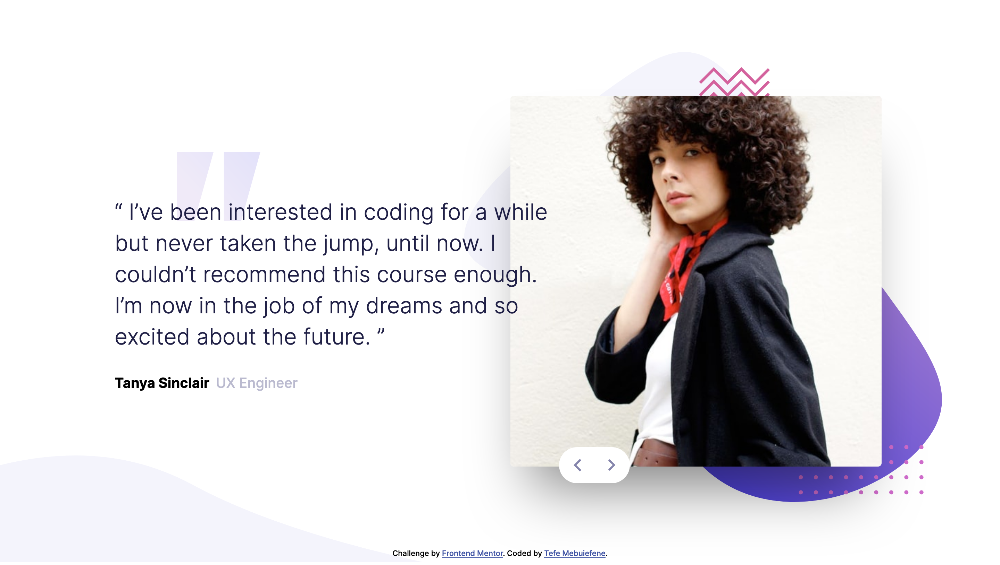

# Frontend Mentor - Coding bootcamp testimonials slider solution

This is a solution to the [Coding bootcamp testimonials slider challenge on Frontend Mentor](https://www.frontendmentor.io/challenges/coding-bootcamp-testimonials-slider-4FNyLA8JL). Frontend Mentor challenges help you improve your coding skills by building realistic projects. 

## Table of contents

- [Overview](#overview)
  - [The challenge](#the-challenge)
  - [Screenshot](#screenshot)
  - [Links](#links)
  - [Built with](#built-with)
- [Author](#author)

## Overview
This is a testimonial slide
### The challenge

Users should be able to:

- View the optimal layout for the component depending on their device's screen size
- Navigate the slider using either their mouse/trackpad or keyboard

### Screenshot

### Links

- Solution URL: [Testimonial slide](https://testimonial-slide-fm.netlify.app/)

### Built with
- Semantic HTML5 markup
- CSS custom properties
- Flexbox

## Author

- Website - [Tefe](https://tefe-website.netlify.app/)
- Frontend Mentor - [@Glorytefe](https://www.frontendmentor.io/profile/Glorytefe)